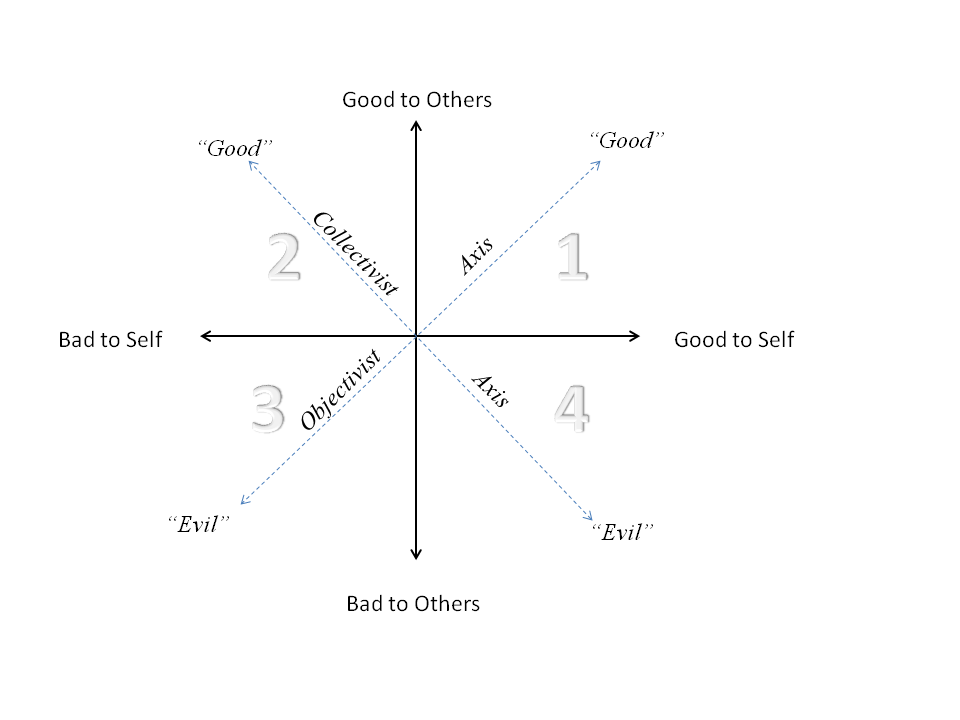

# The Moral Quadrants

<figure><figcaption>
A representation found online, eventually we will create our own diagram but this is close enough for now.
</figcaption></figure>

#### Embracing the Yin and Yang in Decision-Making

In life and decision-making, it's imperative to recognize that strict adherence to what is conventionally deemed "right" may not always lead to the most helpful outcomes. Likewise, actions or paths considered "wrong" by societal standards can sometimes lead to beneficial results. This paradox highlights the necessity for a nuanced understanding of situations, where the wisdom of yin (the receptive, dark, and feminine aspect) and yang (the active, bright, and masculine aspect) must be applied judiciously.

#### The Practical Application of Light and Dark

In practical terms, leveraging both "light" and "dark" can be seen as embracing both strengths and weaknesses, opportunities and threats, with the understanding that every situation and decision carries with it a spectrum of potential outcomes. For instance, in business, aggressive expansion (yang) is often seen as the right strategy for growth. However, there are times when consolidation and introspection (yin) might be more beneficial, allowing for the strengthening of internal processes and the nurturing of company culture.
